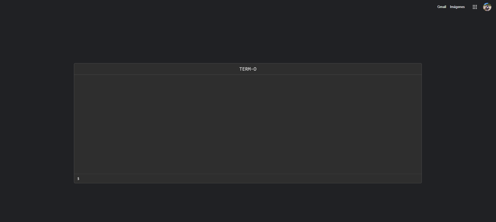
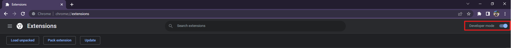
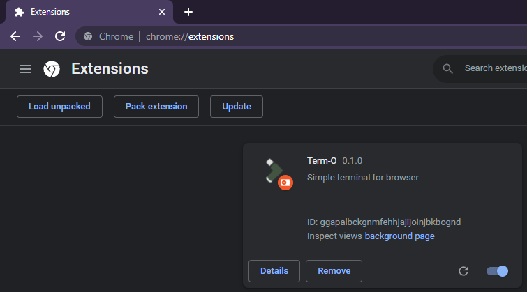

#  TERM-O

## Introduction

This browser extension aims to provide a powerful terminal, easy to use where you can handle your browser as you please.

## Installation

Clone the repo:

```
git clone git@github.com:olmedoluis/term-o.git term-o
```

Set git to track your own repository instead of this one:

```
git remote set-url --delete origin git@github.com:olmedoluis/term-o.git # Remove old origin
git remote set-url --add origin https://github.com/olmedoluis/term-o # Add new origin
```

Install dependencies:

```
npm install # or yarn install
```

## Usage

To run a development server that will watch for file changes and rebuild the scripts, run:

```
npm run start
```

To just build the files without the development server:

```
npm run build
```

Both commands will create a `build/` directory, it will contain the built files that should be loaded into the browser or packed.

Then go to any page outside internal browser pages and type "alt + t":



## Load into Chrome

To load the built files into Chrome, open [chrome://extensions/](chrome://extensions/).

Enable "Developer mode" if it's not enabled yet:



Click on "Load unpacked":


Find the `dist/` directory on your system and open it.

The extension should be now at the top of the page:


