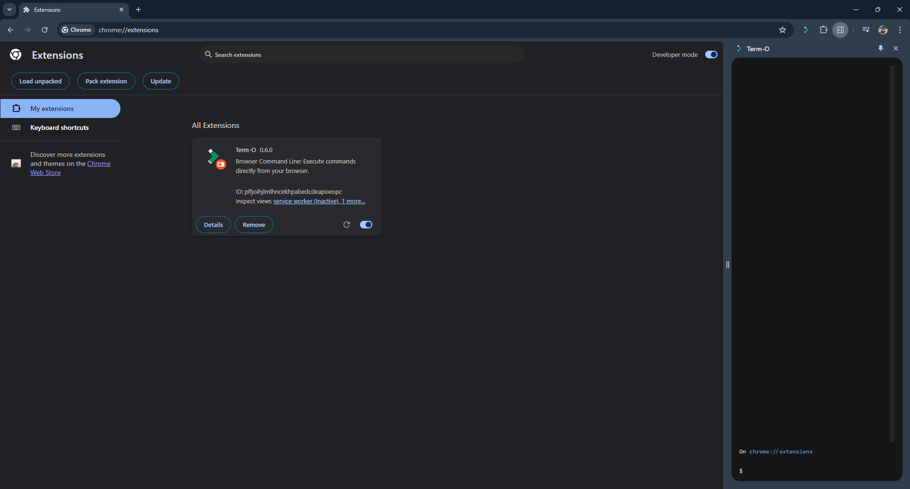
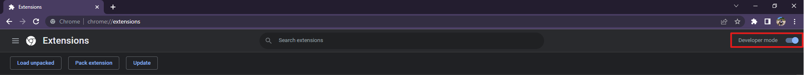
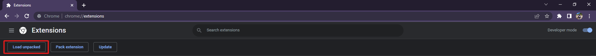

#  TERM-O

## Introduction

TERM-O is a powerful and user-friendly browser extension that provides a terminal-like interface directly in your Chrome browser. Manage your browsing experience efficiently with command line commands.

## Installation

Clone the repo:

```
git clone git@github.com:luis-olmedo-me/term-o.git term-o
```

Open the downloaded folder:

```
cd term-o
```

Install dependencies:

```
yarn install
```

## Usage

To run a development server that will watch for file changes and rebuild the scripts, run:

```
yarn start
```

To just build the files without the development server:

```
yarn build-prod
```

Both commands will create a `build/` directory, it will contain the built files that should be loaded into the browser or packed.

Then, type `alt + t`:



## Load into Chrome

To load the built files into Chrome, open [chrome://extensions/](chrome://extensions/).

Enable "Developer mode" if it's not enabled yet:



Click on "Load unpacked":



Find the `build/` directory on your system and open it.

The extension should be now at the top of the page:


