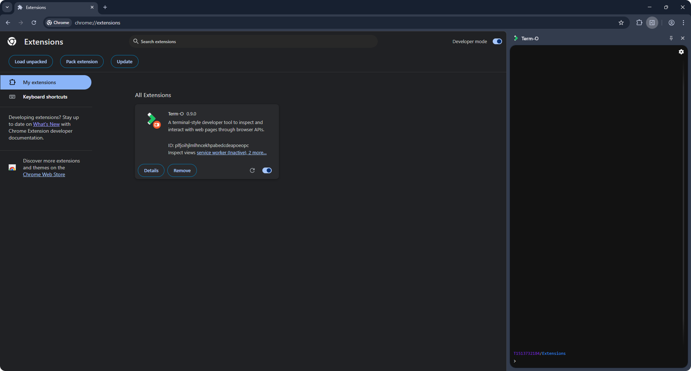
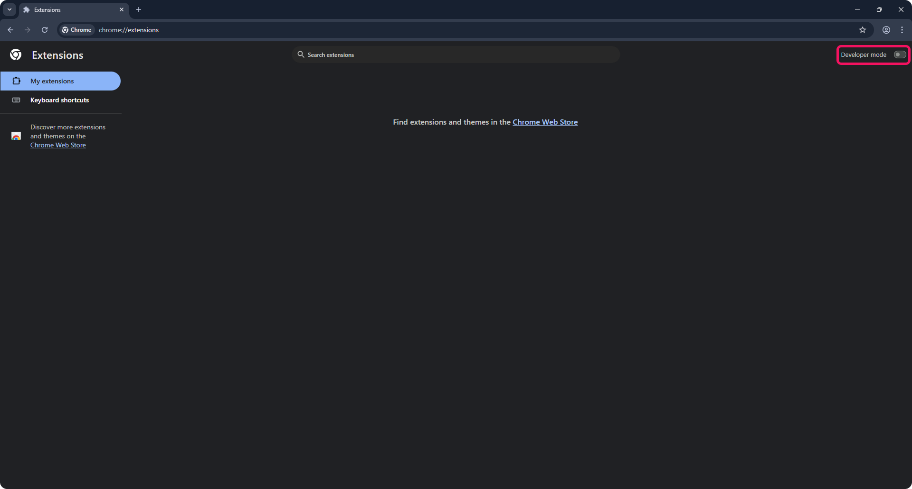
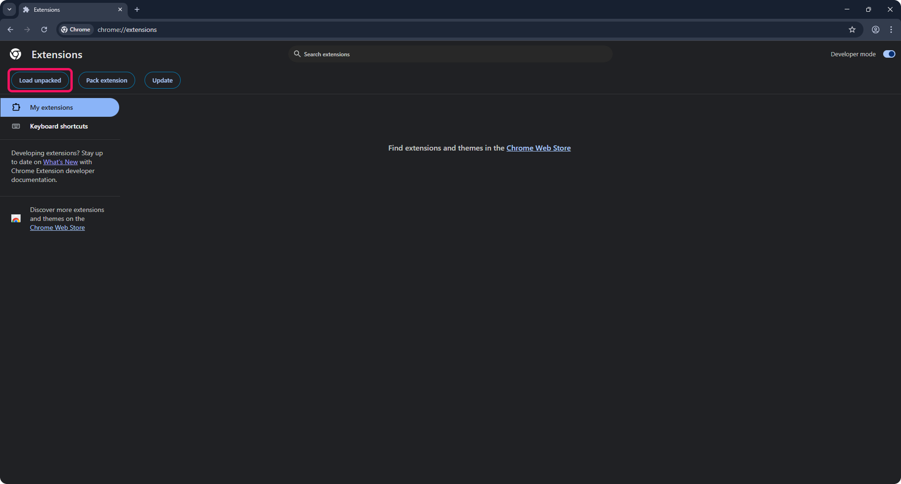
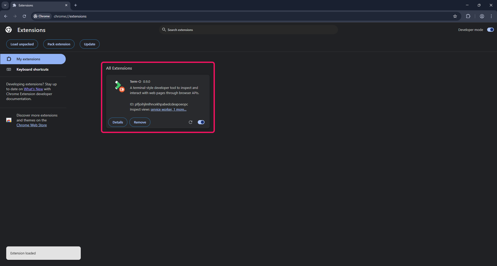

# TERM-O

<picture>
  <source media="(prefers-color-scheme: dark)" srcset="src/tutorial/illustration.png">
  <source media="(prefers-color-scheme: light)" srcset="src/tutorial/illustration.png">
  
</picture>

## Introduction

Term-O is a Browser Extension developer tool for interacting with browser APIs using terminal-style UI.

This documentation only explains how to test Term-O locally. Please review [Term-O Basics](BASICS.ms) for more details.

## Installation

Clone the repo:

```
git clone git@github.com:luis-olmedo-me/term-o.git term-o
```

Open the downloaded folder:

```
cd term-o
```

Install dependencies:

```
yarn install
```

## Usage

To run a development server that will watch for file changes and rebuild the scripts, run:

```
yarn start
```

To just build the files without the development server:

```
yarn build-prod
```

Both commands will create a `build/` directory, it will contain the built files that should be loaded into the browser or packed.

Then, type `alt + t`:


Please review [Term-O Basics](BASICS.ms) for more details.

## Load into Chrome

To load the built files into Chrome, open [chrome://extensions/](chrome://extensions/).

1. Enable "Developer mode" if it's not enabled yet:



2. Click on "Load unpacked":



3. Find the `build/` directory on your system and open it. A notification should appear with the label of "Extension Loaded":


