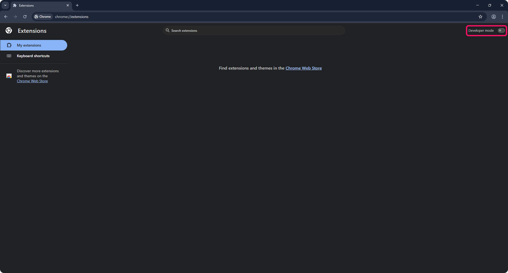
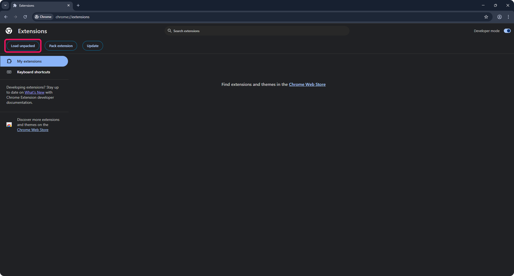
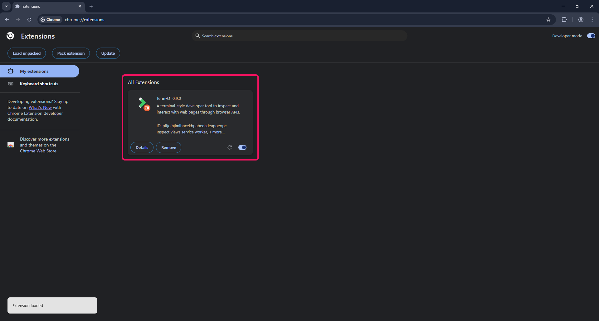

# TERM-O


## Overview

Term-O is a terminal-style developer tool implemented as a browser extension. It exposes browser APIs through a compact command interface so developers and power users can inspect pages, run quick actions and automate workflows.

This README explains how to run Term-O locally and load the built extension into Chrome/Edge. For full usage and command reference see:

- [Term-O Basics](docs/BASICS.md)
- [Term-O Commands](docs/COMMANDS.md)

## Table of Contents

- [Prerequisites](#prerequisites)
- [Installation](#installation)
- [Development & Build](#development--build)
- [Quick Start Examples](#quick-start-examples)
- [Load into Chrome / Edge](#load-into-chrome--edge)
- [Contributing](#contributing)
- [License](#license)

## Prerequisites

- Node.js (LTS recommended, >=16)
- Yarn (or use `npm` equivalents where appropriate)
- Chromium-based browser for testing (Chrome or Edge)

## Installation

Clone the repository and install dependencies:

```bash
git clone git@github.com:luis-olmedo-me/term-o.git term-o
cd term-o
yarn install
```

## Development & Build

Run the development watcher (rebuilds on file changes):

```bash
yarn start
```

Build production assets (no watcher):

```bash
yarn build-prod
```

Both commands output the packed extension into the `build/` directory. Load that folder in your browser (see below).

## Quick Start Examples

Try a few quick commands from the extension terminal UI (see `docs/BASICS.md#quick-start` for more):

```bash
# Show help for the tabs command
tabs --help

# Open a URL and wait until it loads
tabs --open --url "https://example.com" --wait --active

# Search DOM for buttons and show XPath(s)
dom --search --tag "button" --see-xpath
```

## Load into Chrome / Edge

1. Open `chrome://extensions/` (or `edge://extensions/`) in your browser.
2. Enable **Developer mode**.
3. Click **Load unpacked** and select the `build/` directory generated by `yarn start` or `yarn build-prod`.

Screenshots (already included in the repo):

<div style="display: flex; align-items: center; justify-content: center; gap: 12px; flex-wrap: wrap;">
  <div style="text-align: center;">
    
    <p style="margin: 8px 0 0; font-size: 12px;">Developer mode</p>
  </div>
  <div style="font-size: 28px; color: #666; line-height: 1;">→</div>
  <div style="text-align: center;">
    
    <p style="margin: 8px 0 0; font-size: 12px;">Load unpacked</p>
  </div>
  <div style="font-size: 28px; color: #666; line-height: 1;">→</div>
  <div style="text-align: center;">
    
    <p style="margin: 8px 0 0; font-size: 12px;">Extension loaded</p>
  </div>
</div>

Tip: If the extension needs additional permissions, the browser will prompt when the extension is loaded.

## Contributing

Contributions are welcome. Quick guidelines:

- Open an issue to discuss larger changes.
- Fork the repo and create a feature branch for your work.
- Follow existing code patterns and commit messages.
- Run the dev server locally to test changes:

```bash
yarn start
```

- When ready, open a PR with a clear description and testing steps.

If the project had linters or tests, include instructions here (e.g. `yarn lint`, `yarn test`).

## License

This project is distributed under the terms in the `LICENSE` file.

---
